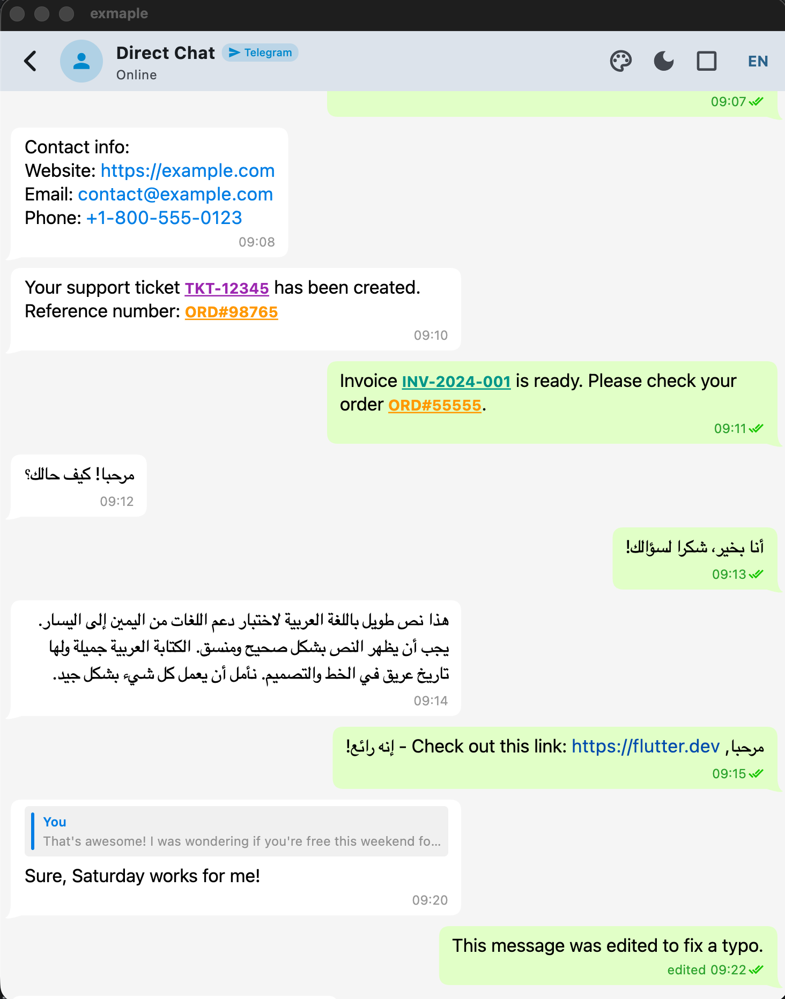
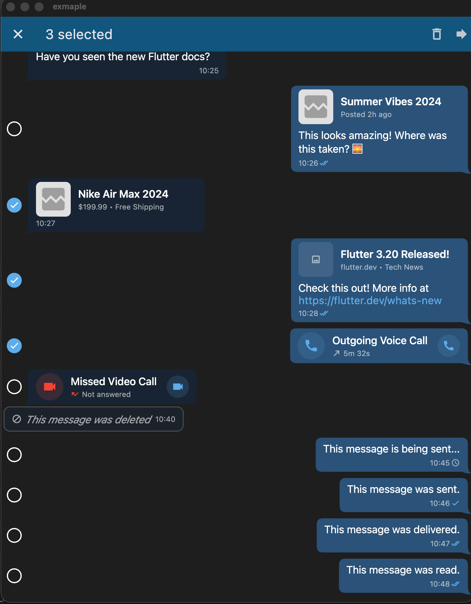
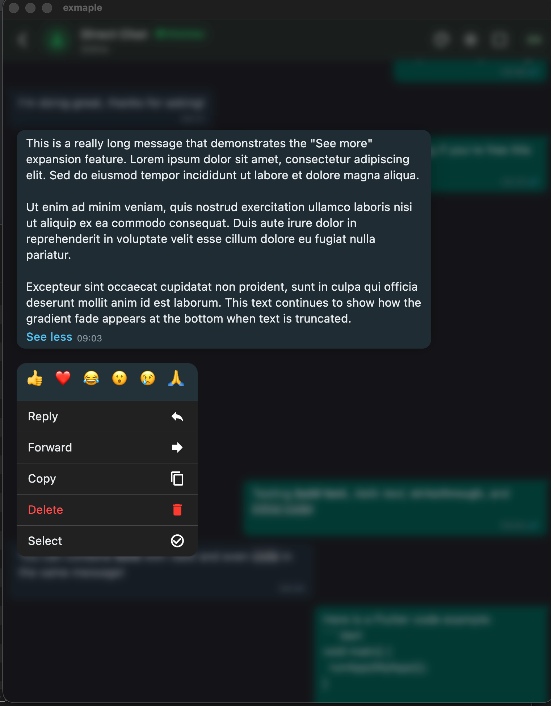
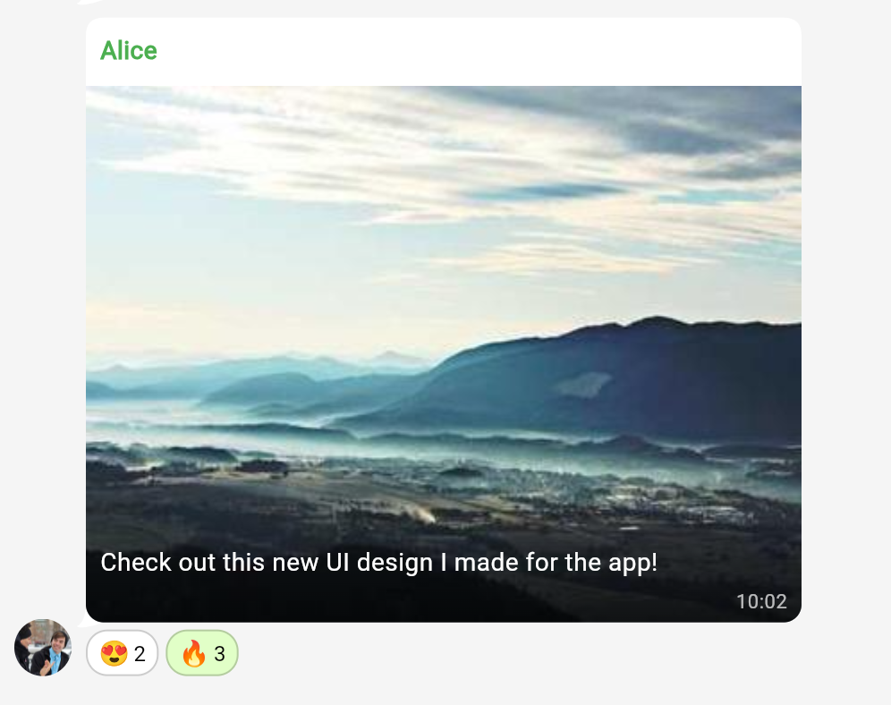
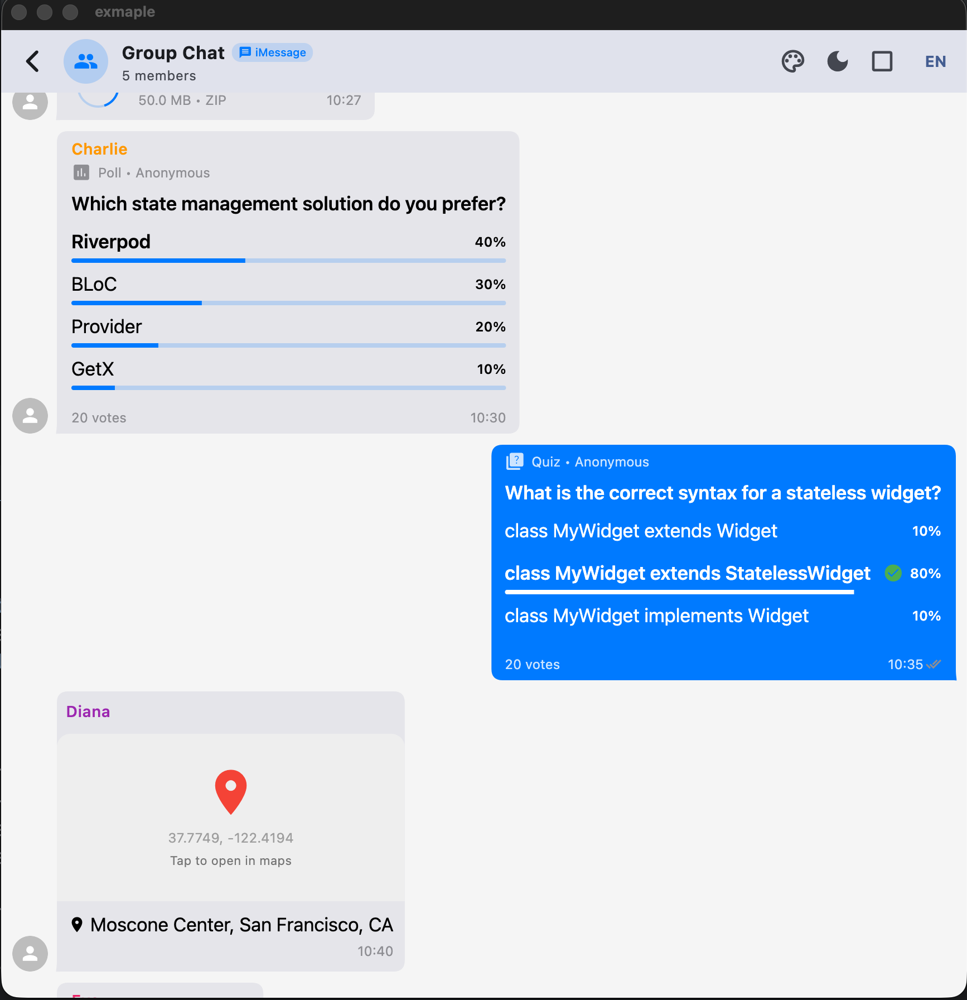
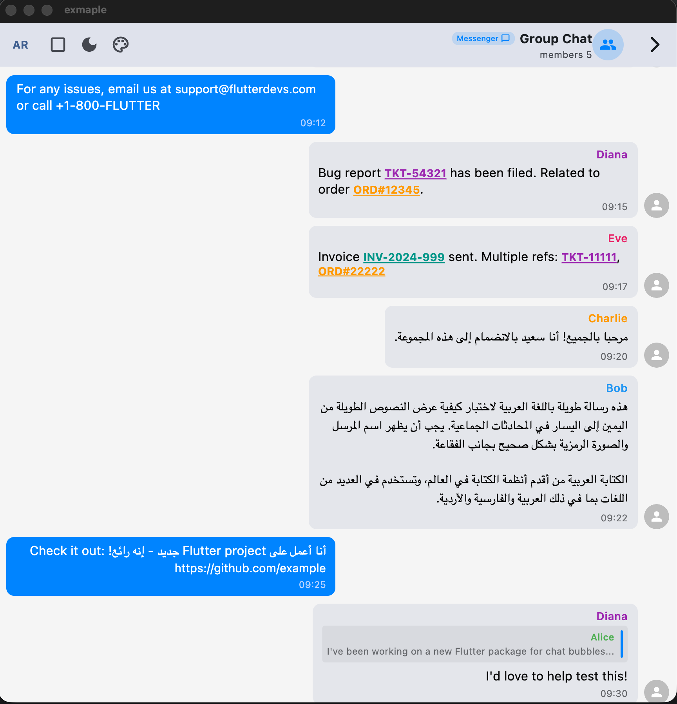
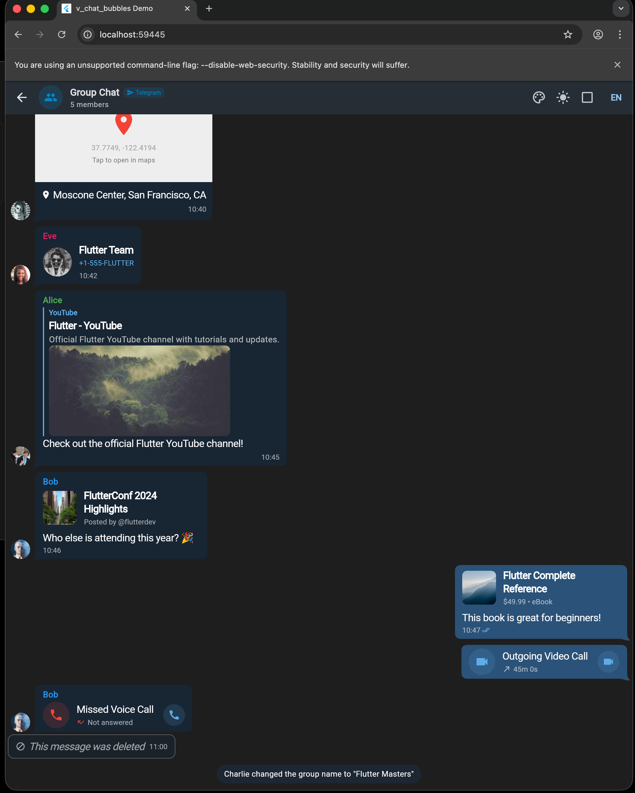

# v_chat_bubbles

A comprehensive Flutter package for building chat interfaces with multiple messaging platform styles (Telegram, WhatsApp, Messenger, iMessage). Provides highly customizable bubble widgets, theming, callbacks, text formatting, and an extensible architecture for custom message types.

[](https://pub.dev/packages/v_chat_bubbles)
[](https://opensource.org/licenses/MIT)

---

## 📸 Screenshots

<table>
  <tr>
    <td align="center">
      
      <br/><b>Preview</b>
    </td>
    <td align="center">
      
      <br/><b>Telegram</b>
    </td>
    <td align="center">
      
      <br/><b>WhatsApp</b>
    </td>
  </tr>
  <tr>
    <td align="center">
      
      <br/><b>Reactions</b>
    </td>
    <td align="center">
      
      <br/><b>Polls & Location</b>
    </td>
    <td align="center">
      
      <br/><b>RTL Support</b>
    </td>
  </tr>
  <tr>
    <td align="center" colspan="3">
      
      <br/><b>Web & Desktop Support</b>
    </td>
  </tr>
</table>

---

## Table of Contents

- [Installation](#installation)
- [Quick Start](#quick-start)
- [Architecture Overview](#architecture-overview)
- [VBubbleScope](#vbubblescope)
- [VBubbleConfig](#vbubbleconfig)
- [VBubbleTheme](#vbubbletheme)
- [VBubbleCallbacks](#vbubblecallbacks)
- [Available Bubble Widgets](#available-bubble-widgets)
- [Text Formatting & Patterns](#text-formatting--patterns)
- [Custom Bubbles](#custom-bubbles)
- [Context Extensions](#context-extensions)
- [Selection Mode](#selection-mode)
- [Performance Optimizations](#performance-optimizations)

---

## Installation

Add to your `pubspec.yaml`:

```yaml
dependencies:
  v_chat_bubbles: ^latest_version
```

Then run:

```bash
flutter pub get
```

---

## Quick Start

```dart
import 'package:v_chat_bubbles/v_chat_bubbles.dart';

class ChatScreen extends StatelessWidget {
  @override
  Widget build(BuildContext context) {
    return VBubbleScope(
      style: VBubbleStyle.telegram,
      config: VBubbleConfig(),
      callbacks: VBubbleCallbacks(
        onTap: (messageId) => print('Tapped: $messageId'),
        onPatternTap: (match) => handlePatternTap(match),
      ),
      child: ListView(
        children: [
          VTextBubble(
            messageId: 'msg_1',
            isMeSender: true,
            time: '12:30',
            text: 'Hello! How are you?',
            status: VMessageStatus.read,
          ),
          VTextBubble(
            messageId: 'msg_2',
            isMeSender: false,
            time: '12:31',
            text: 'I am fine, thanks!',
            senderName: 'John',
            avatar: VPlatformFile.fromUrl(networkUrl: 'https://example.com/avatar.jpg'),
          ),
        ],
      ),
    );
  }
}
```

---

## Architecture Overview

```
VBubbleScope (InheritedWidget - provides config to all children)
    │
    ├── VBubbleStyle (telegram, whatsapp, messenger, imessage, custom)
    ├── VBubbleTheme (colors, typography, gradients)
    ├── VBubbleConfig (nested configuration objects)
    ├── VBubbleCallbacks (event handlers)
    └── Child Widgets
         │
         └── BaseBubble (abstract base class)
              │
              ├── VTextBubble
              ├── VImageBubble
              ├── VVideoBubble
              ├── VVoiceBubble
              ├── VFileBubble
              ├── VLocationBubble
              ├── VContactBubble
              ├── VPollBubble
              ├── VCallBubble
              ├── VGalleryBubble
              ├── VCustomBubble<T>
              └── ... more
```

---

## VBubbleScope

The root widget that provides configuration to all bubble descendants via InheritedWidget.

### Constructor Parameters

| Parameter | Type | Default | Description |
|-----------|------|---------|-------------|
| `style` | `VBubbleStyle` | `telegram` | Visual style preset |
| `theme` | `VBubbleTheme?` | `null` | Custom theme (auto-generated if null) |
| `config` | `VBubbleConfig` | `VBubbleConfig()` | Configuration object |
| `callbacks` | `VBubbleCallbacks` | `VBubbleCallbacks()` | Event callbacks |
| `isSelectionMode` | `bool` | `false` | Enable multi-selection |
| `selectedIds` | `Set<String>` | `{}` | Currently selected message IDs |
| `menuItemsBuilder` | `VMenuItemsBuilder?` | `null` | Dynamic context menu items |
| `child` | `Widget` | required | Child widget tree |

### Available Styles

```dart
enum VBubbleStyle {
  telegram,   // Gradient bubbles with distinctive tails
  whatsapp,   // Green outgoing, white incoming
  messenger,  // Blue gradient outgoing, gray incoming
  imessage,   // Blue outgoing, gray incoming, minimal tails
  custom,     // Fully custom styling
}
```

### Example

```dart
VBubbleScope(
  style: VBubbleStyle.whatsapp,
  theme: VBubbleTheme.whatsappLight(),
  config: VBubbleConfig.groupChat(),
  callbacks: _buildCallbacks(),
  isSelectionMode: _isSelectionMode,
  selectedIds: _selectedIds,
  menuItemsBuilder: (messageId, messageType, isMeSender) {
    return isMeSender
      ? [VDefaultMenuItems.edit, VDefaultMenuItems.delete]
      : [VDefaultMenuItems.reply, VDefaultMenuItems.forward];
  },
  child: ListView.builder(...),
)
```

---

## VBubbleConfig

Nested configuration object controlling all aspects of bubble behavior.

### Constructor

```dart
VBubbleConfig({
  VPatternConfig patterns,
  VGestureConfig gestures,
  VAvatarConfig avatar,
  VSizingConfig sizing,
  VSpacingConfig spacing,
  VMediaConfig media,
  VTextExpansionConfig textExpansion,
  VAnimationConfig animation,
  VAccessibilityConfig accessibility,
  VTranslationConfig translations,
})
```

### Config Presets

```dart
VBubbleConfig()              // Default configuration
VBubbleConfig.compact()      // Dense layout, smaller elements
VBubbleConfig.desktop()      // Wider bubbles, more spacing
VBubbleConfig.readOnly()     // No gestures (view-only mode)
VBubbleConfig.directChat()   // Hidden avatars (1:1 chat)
VBubbleConfig.groupChat()    // Always show avatars
VBubbleConfig.minimal()      // No tails, clean look
VBubbleConfig.accessible()   // Enhanced accessibility
VBubbleConfig.performance()  // No animations, minimal processing
```

---

### VPatternConfig

Controls text pattern detection and formatting.

| Property | Type | Default | Description |
|----------|------|---------|-------------|
| `enableLinks` | `bool` | `true` | Detect URLs |
| `enableEmails` | `bool` | `true` | Detect email addresses |
| `enablePhones` | `bool` | `true` | Detect phone numbers |
| `enableMentions` | `bool` | `false` | Detect @username |
| `enableHashtags` | `bool` | `false` | Detect #hashtag |
| `enableFormatting` | `bool` | `false` | Enable *bold*, _italic_, ~strike~, \`code\` |
| `enableCodeBlocks` | `bool` | `false` | Enable \`\`\`code blocks\`\`\` |
| `enableBlockquotes` | `bool` | `false` | Enable > blockquotes |
| `enableBulletLists` | `bool` | `false` | Enable - bullet lists |
| `enableNumberedLists` | `bool` | `false` | Enable 1. numbered lists |
| `customPatterns` | `List<VCustomPattern>?` | `null` | Custom regex patterns |

**Presets:**

```dart
VPatternConfig.standard      // Links, emails, phones
VPatternConfig.none          // No detection
VPatternConfig.linksOnly     // Only URLs
VPatternConfig.withFormatting // Standard + inline formatting
VPatternConfig.markdown      // Full markdown support (all patterns)
VPatternConfig.blocksOnly    // Only block-level patterns
```

**Custom Pattern Example:**

```dart
VPatternConfig(
  enableLinks: true,
  customPatterns: [
    VCustomPattern(
      id: 'ticket',
      pattern: RegExp(r'TKT-\d+'),
      style: TextStyle(color: Colors.purple, fontWeight: FontWeight.bold),
      isTappable: true,
    ),
    VCustomPattern(
      id: 'order',
      pattern: RegExp(r'ORD#\d+'),
      style: TextStyle(color: Colors.orange),
      isTappable: true,
    ),
  ],
)
```

---

### VGestureConfig

Controls gesture interactions.

| Property | Type | Default | Description |
|----------|------|---------|-------------|
| `enableSwipeToReply` | `bool` | `true` | Swipe right to reply |
| `enableLongPress` | `bool` | `true` | Long press for context menu |
| `enableDoubleTapToReact` | `bool` | `false` | Double tap to add reaction |
| `enableHapticFeedback` | `bool` | `true` | Vibration on interactions |
| `swipeThreshold` | `double` | `64` | Swipe distance to trigger reply |

**Presets:**

```dart
VGestureConfig.all   // All gestures enabled
VGestureConfig.none  // No gestures (read-only)
```

---

### VAvatarConfig

Controls avatar display.

| Property | Type | Default | Description |
|----------|------|---------|-------------|
| `show` | `bool` | `true` | Show avatars |
| `position` | `VAvatarPosition` | `bottom` | Avatar position (top/bottom) |
| `size` | `double` | `32` | Avatar diameter |

**Presets:**

```dart
VAvatarConfig.visible  // Show avatars
VAvatarConfig.hidden   // Hide avatars
VAvatarConfig.large    // Larger avatars (40px)
```

---

### VSizingConfig

Controls bubble dimensions.

| Property | Type | Default | Description |
|----------|------|---------|-------------|
| `maxWidthFraction` | `double` | `0.75` | Max width as fraction of screen |
| `maxWidth` | `double?` | `null` | Absolute max width |
| `minWidth` | `double` | `80` | Minimum bubble width |

**Presets:**

```dart
VSizingConfig.standard  // 75% max width
VSizingConfig.compact   // 65% max width
VSizingConfig.wide      // 85% max width
```

---

### VSpacingConfig

Controls spacing and padding.

| Property | Type | Default | Description |
|----------|------|---------|-------------|
| `bubbleRadius` | `double` | `16` | Bubble corner radius |
| `tailSize` | `double` | `8` | Bubble tail size |
| `sameSenderSpacing` | `double` | `2` | Space between same-sender messages |
| `differentSenderSpacing` | `double` | `8` | Space between different-sender messages |
| `contentPaddingHorizontal` | `double` | `12` | Horizontal content padding |
| `contentPaddingVertical` | `double` | `8` | Vertical content padding |

---

### VMediaConfig

Controls media message display.

| Property | Type | Default | Description |
|----------|------|---------|-------------|
| `cornerRadius` | `double` | `12` | Media corner radius |
| `imageMaxHeight` | `double` | `300` | Max image height |
| `videoMaxHeight` | `double` | `250` | Max video height |
| `voiceWaveformHeight` | `double` | `32` | Voice waveform height |
| `fileMessageWidth` | `double` | `240` | File bubble width |
| `gallerySpacing` | `double` | `2` | Gallery grid spacing |

---

### VTextExpansionConfig

Controls expandable text behavior.

| Property | Type | Default | Description |
|----------|------|---------|-------------|
| `enabled` | `bool` | `true` | Enable text expansion |
| `characterThreshold` | `int` | `500` | Characters before truncation |

---

### VAnimationConfig

Controls animation durations.

| Property | Type | Default | Description |
|----------|------|---------|-------------|
| `fadeIn` | `Duration` | `200ms` | Fade in duration |
| `fadeOut` | `Duration` | `150ms` | Fade out duration |
| `expand` | `Duration` | `300ms` | Expand animation |
| `collapse` | `Duration` | `250ms` | Collapse animation |
| `highlight` | `Duration` | `1500ms` | Highlight animation |
| `swipe` | `Duration` | `600ms` | Swipe animation |
| `defaultCurve` | `Curve` | `easeOutCubic` | Animation curve |

**Presets:**

```dart
VAnimationConfig.standard  // Default timings
VAnimationConfig.fast      // Snappy animations
VAnimationConfig.slow      // Smooth animations
VAnimationConfig.none      // No animations (instant)
```

---

### VAccessibilityConfig

Controls accessibility features.

| Property | Type | Default | Description |
|----------|------|---------|-------------|
| `enableSemanticLabels` | `bool` | `true` | Screen reader labels |
| `minTapTargetSize` | `double` | `48` | Minimum tap target (44+ recommended) |
| `enableHighContrast` | `bool` | `false` | High contrast mode |
| `semanticLabelBuilder` | `Function?` | `null` | Custom semantic label builder |

---

### VTranslationConfig

Controls localized strings.

```dart
VTranslationConfig(
  seeMore: 'See more',
  seeLess: 'See less',
  edited: 'edited',
  forwarded: 'Forwarded',
  repliedTo: 'Replied to',
  you: 'You',
  // ... more
)

// Preset for locale
VTranslationConfig.forLocale(Locale('ar'))  // Arabic translations
VTranslationConfig.forLocale(Locale('en'))  // English translations
```

---

## VBubbleTheme

Controls colors, typography, and visual styling.

### Factory Constructors

```dart
// Style + brightness combinations
VBubbleTheme.telegramLight()
VBubbleTheme.telegramDark()
VBubbleTheme.whatsappLight()
VBubbleTheme.whatsappDark()
VBubbleTheme.messengerLight()
VBubbleTheme.messengerDark()
VBubbleTheme.imessageLight()
VBubbleTheme.imessageDark()

// Get theme by enum
VBubbleTheme.fromStyle(VBubbleStyle.telegram, brightness: Brightness.light)

// Custom theme
VBubbleTheme.custom(
  outgoingBubbleColor: Colors.blue,
  incomingBubbleColor: Colors.grey[200]!,
  accentColor: Colors.blue,
  brightness: Brightness.light,
)
```

### Key Properties

| Property | Type | Description |
|----------|------|-------------|
| `outgoingBubbleColor` | `Color` | Sent message bubble color |
| `incomingBubbleColor` | `Color` | Received message bubble color |
| `outgoingTextColor` | `Color` | Sent message text color |
| `incomingTextColor` | `Color` | Received message text color |
| `outgoingBubbleGradient` | `Gradient?` | Gradient for sent bubbles |
| `incomingBubbleGradient` | `Gradient?` | Gradient for received bubbles |
| `outgoingLinkColor` | `Color` | Link color in sent messages |
| `incomingLinkColor` | `Color` | Link color in received messages |
| `messageTextStyle` | `TextStyle` | Message body text style |
| `timeTextStyle` | `TextStyle` | Timestamp text style |
| `senderNameTextStyle` | `TextStyle` | Sender name text style |
| `captionTextStyle` | `TextStyle` | Caption text style |
| `linkTextStyle` | `TextStyle` | Link text style |
| `availableReactions` | `List<String>` | Emoji reactions for menu |
| `readIconColor` | `Color` | Read receipt checkmark color |

---

## VBubbleCallbacks

Event handlers for bubble interactions.

### Context Menu Behavior

By default, long-pressing a bubble opens the built-in iOS-style context menu (CupertinoContextMenu). You can customize this behavior:

| Scenario | Behavior |
|----------|----------|
| `onLongPress` **not set** | Built-in context menu opens |
| `onLongPress` **is set** | Your custom callback is called, built-in menu does NOT open |

```dart
// Option 1: Use built-in context menu (default)
VBubbleCallbacks(
  // No onLongPress - built-in menu will open
  onMenuItemSelected: (messageId, item) {
    // Handle menu item selection
  },
)

// Option 2: Custom long press handler (replaces built-in menu)
VBubbleCallbacks(
  onLongPress: (messageId, position) {
    // Show your own menu at position
    showMenu(
      context: context,
      position: RelativeRect.fromLTRB(
        position.dx, position.dy, position.dx, position.dy,
      ),
      items: [
        PopupMenuItem(child: Text('Reply')),
        PopupMenuItem(child: Text('Copy')),
        PopupMenuItem(child: Text('Delete')),
      ],
    );
  },
)
```

### All Callbacks

```dart
VBubbleCallbacks(
  // === Core Callbacks ===
  onTap: (String messageId) { },
  onLongPress: (String messageId, Offset position) { }, // Replaces built-in menu when set
  onSwipeReply: (String messageId) { },
  onSelectionChanged: (String messageId, bool isSelected) { },
  onAvatarTap: (String senderId) { },
  onReplyPreviewTap: (String originalMessageId) { },

  // === Grouped Callbacks ===
  onReaction: (String messageId, String emoji, ReactionAction action) { },
  onReactionTap: (String messageId, String emoji, Offset position) { },
  onPatternTap: (VPatternMatch match) { },
  onMediaTap: (VMediaTapData data) { },
  onMenuItemSelected: (String messageId, VBubbleMenuItem item) { },

  // === Type-Specific Callbacks ===
  onPollVote: (String messageId, String optionId) { },
  onLocationTap: (VLocationTapData data) { },
  onContactTap: (VContactTapData data) { },
  onCallTap: (String messageId, bool isVideo) { },
  onExpandToggle: (String messageId, bool isExpanded) { },
  onDownload: (String messageId) { },
  onTransferStateChanged: (String messageId, VMediaTransferAction action) { },
)
```

### Pattern Match Object

```dart
class VPatternMatch {
  final String patternId;    // 'url', 'email', 'phone', 'mention', or custom ID
  final String matchedText;  // The matched text (transformed if applicable)
  final String rawText;      // Original matched text
  final String? messageId;   // Parent message ID
}
```

### Example Handler

```dart
onPatternTap: (match) {
  switch (match.patternId) {
    case 'url':
      launchUrl(Uri.parse(match.matchedText));
      break;
    case 'email':
      launchUrl(Uri.parse('mailto:${match.matchedText}'));
      break;
    case 'phone':
      launchUrl(Uri.parse('tel:${match.matchedText}'));
      break;
    case 'mention':
      navigateToUser(match.matchedText);
      break;
    case 'ticket':  // Custom pattern
      openTicket(match.matchedText);
      break;
  }
}
```

---

## Available Bubble Widgets

### Common Properties (BaseBubble)

All bubble widgets share these properties:

| Property | Type | Required | Description |
|----------|------|----------|-------------|
| `messageId` | `String` | Yes | Unique message identifier |
| `isMeSender` | `bool` | Yes | True if current user sent |
| `time` | `String` | Yes | Display time (e.g., "12:30") |
| `status` | `VMessageStatus?` | No | Delivery status |
| `isSameSender` | `bool` | No | Same sender as previous message |
| `avatar` | `VPlatformFile?` | No | Sender avatar image |
| `senderName` | `String?` | No | Sender display name |
| `senderColor` | `Color?` | No | Sender name color |
| `replyTo` | `VReplyData?` | No | Reply preview data |
| `forwardedFrom` | `VForwardData?` | No | Forward info |
| `reactions` | `List<VBubbleReaction>` | No | Message reactions |
| `isEdited` | `bool` | No | Show "edited" label |
| `isPinned` | `bool` | No | Show pin indicator |
| `isStarred` | `bool` | No | Show star indicator |
| `isHighlighted` | `bool` | No | Highlight animation |

### VTextBubble

```dart
VTextBubble(
  messageId: 'msg_1',
  isMeSender: true,
  time: '12:30',
  text: 'Hello *world*! Check https://flutter.dev',
  linkPreview: VLinkPreviewData(
    url: 'https://flutter.dev',
    title: 'Flutter',
    description: 'Build apps for any screen',
    image: VPlatformFile.fromUrl(networkUrl: '...'),
  ),
  status: VMessageStatus.read,
)
```

### VImageBubble

```dart
VImageBubble(
  messageId: 'msg_2',
  isMeSender: false,
  time: '12:31',
  imageFile: VPlatformFile.fromUrl(networkUrl: 'https://example.com/image.jpg'),
  caption: 'Beautiful sunset!',
  aspectRatio: 16/9,
)
```

### VVideoBubble

```dart
VVideoBubble(
  messageId: 'msg_3',
  isMeSender: true,
  time: '12:32',
  videoFile: VPlatformFile.fromUrl(
    networkUrl: 'https://example.com/video.mp4',
    fileSize: 15728640, // 15 MB
  ),
  thumbnailFile: VPlatformFile.fromUrl(networkUrl: '...'),
  duration: Duration(minutes: 2, seconds: 30),
  caption: 'Check this out!',
)
```

### VVoiceBubble

```dart
VVoiceBubble(
  messageId: 'msg_4',
  isMeSender: false,
  time: '12:33',
  controller: VVoiceMessageController(
    audioSrc: 'https://example.com/voice.mp3',
    maxDuration: Duration(minutes: 1, seconds: 30),
    waveform: [0.2, 0.5, 0.8, 0.3, 0.6, ...], // Optional waveform data
  ),
)
```

### VFileBubble

```dart
VFileBubble(
  messageId: 'msg_5',
  isMeSender: true,
  time: '12:34',
  file: VPlatformFile.fromUrl(
    networkUrl: 'https://example.com/document.pdf',
    fileSize: 2457600, // 2.4 MB
  ),
  transferState: VTransferState.completed,
)
```

### VLocationBubble

```dart
VLocationBubble(
  messageId: 'msg_6',
  isMeSender: false,
  time: '12:35',
  locationData: VLocationData(
    latitude: 40.7128,
    longitude: -74.0060,
    address: 'New York, NY',
    staticMapUrl: 'https://maps.example.com/static/...',
  ),
)
```

### VContactBubble

```dart
VContactBubble(
  messageId: 'msg_7',
  isMeSender: true,
  time: '12:36',
  contactData: VContactData(
    name: 'John Smith',
    phoneNumber: '+1-555-123-4567',
    avatar: VPlatformFile.fromUrl(networkUrl: '...'),
  ),
)
```

### VPollBubble

```dart
VPollBubble(
  messageId: 'msg_8',
  isMeSender: false,
  time: '12:37',
  pollData: VPollData(
    question: 'What is your favorite framework?',
    options: [
      VPollOption(id: '1', text: 'Flutter', voteCount: 150, percentage: 60),
      VPollOption(id: '2', text: 'React Native', voteCount: 75, percentage: 30),
      VPollOption(id: '3', text: 'Other', voteCount: 25, percentage: 10),
    ],
    totalVotes: 250,
    hasVoted: true,
    mode: VPollMode.single,
  ),
)
```

### VCallBubble

```dart
VCallBubble(
  messageId: 'msg_9',
  isMeSender: true,
  time: '12:38',
  callData: VCallData(
    type: VCallType.video,
    status: VCallStatus.completed,
    duration: Duration(minutes: 5, seconds: 30),
  ),
)
```

### VGalleryBubble

```dart
VGalleryBubble(
  messageId: 'msg_10',
  isMeSender: false,
  time: '12:39',
  items: [
    VGalleryItemData(messageId: 'img_1', file: VPlatformFile.fromUrl(...)),
    VGalleryItemData(messageId: 'img_2', file: VPlatformFile.fromUrl(...)),
    VGalleryItemData(messageId: 'img_3', file: VPlatformFile.fromUrl(...)),
  ],
)
```

### VSystemBubble

```dart
VSystemBubble(text: 'John joined the group')
```

### VDateChip

```dart
VDateChip(date: 'Today')
```

### VDeletedBubble

```dart
VDeletedBubble(
  isMeSender: true,
  time: '12:40',
)
```

---

## Text Formatting & Patterns

### Supported Syntax

| Format | Syntax | Output |
|--------|--------|--------|
| Bold | `*text*` | **text** |
| Italic | `_text_` | _text_ |
| Strikethrough | `~text~` | ~~text~~ |
| Inline Code | `` `code` `` | `code` |
| Code Block | ` ```code``` ` | Syntax highlighted block |
| Blockquote | `> text` | Indented quote |
| Bullet List | `- item` | Bulleted list |
| Numbered List | `1. item` | Numbered list |

### Enable Formatting

```dart
VBubbleConfig(
  patterns: VPatternConfig(
    enableFormatting: true,     // Bold, italic, etc.
    enableCodeBlocks: true,     // ```code```
    enableBlockquotes: true,    // > quotes
    enableBulletLists: true,    // - items
    enableNumberedLists: true,  // 1. items
  ),
)

// Or use preset
VBubbleConfig(patterns: VPatternConfig.markdown)
```

---

## Custom Bubbles

Create custom bubble widgets using `VCustomBubble` or by extending `BaseBubble`.

### Using VCustomBubble (Quick & Easy)

```dart
// 1. Define your data model
@immutable
class VPaymentData extends VCustomBubbleData {
  final double amount;
  final String currency;

  const VPaymentData({required this.amount, this.currency = 'USD'});

  @override
  String get contentType => 'payment';
}

// 2. Use VCustomBubble with a builder
VCustomBubble<VPaymentData>(
  messageId: 'msg_payment_1',
  isMeSender: true,
  time: '12:30',
  data: VPaymentData(amount: 99.99),
  builder: (context, data) {
    final theme = context.bubbleTheme;
    final textColor = theme.outgoingTextColor;
    return Column(
      crossAxisAlignment: CrossAxisAlignment.start,
      children: [
        Row(
          children: [
            Icon(Icons.payment, color: Colors.green),
            SizedBox(width: 8),
            Text('Payment', style: TextStyle(color: textColor, fontWeight: FontWeight.bold)),
          ],
        ),
        SizedBox(height: 8),
        Text('\$${data.amount}', style: TextStyle(color: textColor, fontSize: 24)),
      ],
    );
  },
)
```

### Extending BaseBubble (Full Control)

```dart
class VPaymentBubble extends BaseBubble {
  final VPaymentData paymentData;

  @override
  String get messageType => 'payment';

  const VPaymentBubble({
    super.key,
    required super.messageId,
    required super.isMeSender,
    required super.time,
    required this.paymentData,
    super.status,
    super.isSameSender,
    super.avatar,
    super.senderName,
    super.senderColor,
  });

  @override
  Widget buildContent(BuildContext context) {
    final theme = context.bubbleTheme;
    final textColor = selectTextColor(theme);

    return buildBubbleContainer(
      context: context,
      showTail: !isSameSender,
      child: Column(
        crossAxisAlignment: CrossAxisAlignment.start,
        mainAxisSize: MainAxisSize.min,
        children: [
          Row(
            children: [
              Icon(Icons.payment, color: textColor),
              SizedBox(width: 8),
              Text('Payment', style: TextStyle(color: textColor, fontWeight: FontWeight.bold)),
            ],
          ),
          SizedBox(height: 8),
          Text(
            '\$${paymentData.amount.toStringAsFixed(2)}',
            style: TextStyle(color: textColor, fontSize: 24, fontWeight: FontWeight.w600),
          ),
          SizedBox(height: 8),
          buildMeta(context),
        ],
      ),
    );
  }
}
```

### Available Helper Methods in BaseBubble

| Method | Description |
|--------|-------------|
| `buildBubbleContainer()` | Wraps content with styled bubble shape |
| `buildBubbleHeader()` | Forward header + sender name + reply preview |
| `buildMeta()` | Timestamp + status + flags |
| `buildTimestamp()` | Just timestamp widget |
| `buildStatusIcon()` | Just status indicator |
| `buildReactionsWidget()` | Reaction pills row |
| `selectTextColor(theme)` | Get correct text color |
| `selectSecondaryTextColor(theme)` | Get secondary text color |
| `selectLinkColor(theme)` | Get link/accent color |

---

## Context Extensions

Access scope data from any descendant widget:

```dart
// Full scope
final scope = context.bubbleScope;

// Individual properties
final theme = context.bubbleTheme;
final config = context.bubbleConfig;
final callbacks = context.bubbleCallbacks;
final style = context.bubbleStyle;

// Expansion state
final expandManager = context.expandStateManager;
final isExpanded = expandManager.isExpanded('msg_123');

// Custom builders
final hasBuilder = context.hasCustomBubbleBuilder('payment');
final builder = context.getCustomBubbleBuilder('payment');
```

---

## Selection Mode

Enable multi-selection for bulk operations:

```dart
class _ChatState extends State<ChatScreen> {
  bool _isSelectionMode = false;
  final Set<String> _selectedIds = {};

  @override
  Widget build(BuildContext context) {
    return VBubbleScope(
      isSelectionMode: _isSelectionMode,
      selectedIds: _selectedIds,
      callbacks: VBubbleCallbacks(
        onSelectionChanged: (messageId, isSelected) {
          setState(() {
            if (isSelected) {
              _selectedIds.add(messageId);
              _isSelectionMode = true;
            } else {
              _selectedIds.remove(messageId);
              if (_selectedIds.isEmpty) _isSelectionMode = false;
            }
          });
        },
      ),
      menuItemsBuilder: (messageId, messageType, isMeSender) {
        return [...VDefaultMenuItems.textDefaults]; // Includes select option
      },
      child: ...,
    );
  }
}
```

### Default Menu Items

```dart
VDefaultMenuItems.reply
VDefaultMenuItems.forward
VDefaultMenuItems.copy
VDefaultMenuItems.delete
VDefaultMenuItems.download
VDefaultMenuItems.pin
VDefaultMenuItems.star
VDefaultMenuItems.select    // Triggers selection mode
VDefaultMenuItems.edit
VDefaultMenuItems.report

// Preset lists
VDefaultMenuItems.textDefaults   // reply, forward, copy, edit, pin, delete, select
VDefaultMenuItems.mediaDefaults  // reply, forward, download, pin, delete
```

---

## Performance Optimizations

The package includes several built-in optimizations:

### Caching System

- **Span caching**: Parsed text spans cached per message
- **Pattern caching**: Built pattern lists cached per config
- **Block widget caching**: Block-level widgets cached
- **Text direction caching**: RTL/LTR detection cached

### Efficient Rendering

- **shouldRepaint optimization**: Bubble painters only repaint when properties change
- **IntrinsicWidth wrapping**: Bubbles shrink-wrap to content
- **Lazy parsing**: Block patterns only parsed when enabled
- **Fast path detection**: Quick checks before expensive regex operations

### Best Practices

```dart
// Use performance preset for very long lists
VBubbleConfig.performance()

// Disable unused patterns
VPatternConfig(
  enableLinks: true,
  enableEmails: false,  // Disable if not needed
  enablePhones: false,
  enableFormatting: false,
)

// Use appropriate image sizes
VPlatformFile.fromUrl(
  networkUrl: thumbnailUrl,  // Use thumbnails, not full images
)
```

---

## License

MIT License - see LICENSE file for details.

---

## Author

**Hatem Ragap**
📧 Email: hatemragapdev@gmail.com
🔗 GitHub: [github.com/hatemragab](https://github.com/hatemragab)

---

## Support

For issues, feature requests, or questions:
- 📧 Email: hatemragapdev@gmail.com
- 🐛 GitHub Issues: [Create an issue](https://github.com/v-chat-sdk/v_chat_bubbles/issues)
- ⭐ Star us on GitHub if you find this package useful!
